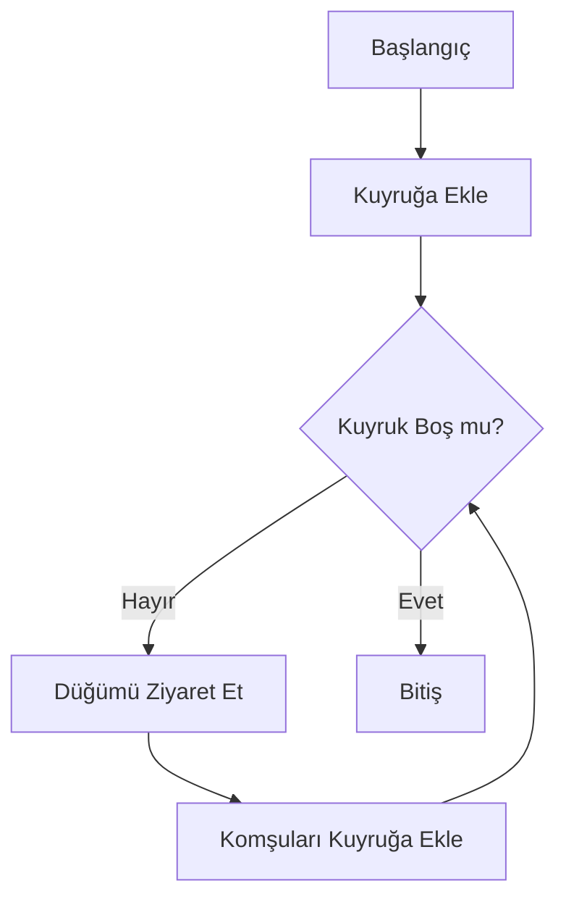
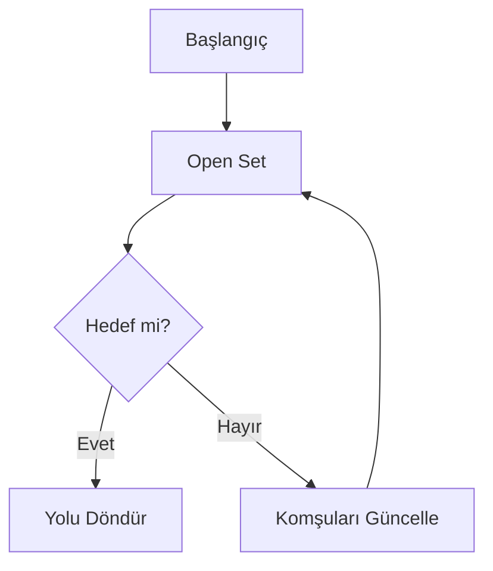
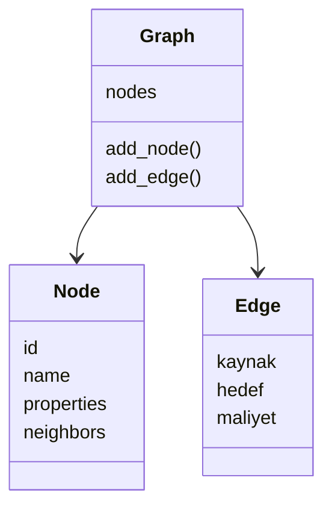

# Uni-Sosyal-Medya
=======
# Üniversite Sosyal Ağ Analizi Uygulaması

## 1. Proje Adı, Ekip Üyeleri, Tarih

- **Ders:** Yazılım Geliştirme Laboratuvarı-I  
- **Bölüm:** Bilişim Sistemleri Mühendisliği  
- **Üniversite:** Kocaeli Üniversitesi  

**Ekip Üyeleri:**
- Furkan Demirci
- (2. ekip üyesi)

**Tarih:** Aralık 2025

---

## 2. Giriş (Problem Tanımı ve Amaç)

Bu proje, günümüz sosyal ağlarındaki karmaşık kullanıcı ilişkilerini analiz 
etmek amacıyla geliştirilmiştir. Sosyal ağları birer yönsüz ve ağırlıklı graf olarak 
modelleyen uygulamamız; kullanıcıları **düğüm (node)**, etkileşimleri ise **kenar (edge)** olarak tanımlar. 
Temel amacımız, dinamik bir sosyal ağda en kısa yolu bulmak, 
toplulukları ayrıştırmak ve en etkili kullanıcıları (influencer) bilimsel metotlarla tespit etmektir. 
Proje sürecinde nesne yönelimli programlama (OOP) ve veri yapıları prensipleri temel alınmıştır.

---

## 3. Gerçeklenen Algoritmalar

### 3.1 Breadth First Search (BFS)

**Çalışma Mantığı:**  
Ağ üzerindeki bir kullanıcıdan yola çıkarak ulaşılabilen tüm "tanıdık" 
ağını tespit etmek için Breadth-First Search (BFS) ve Depth-First Search (DFS) 
algoritmalarını kullandık.BFS, Katman katman ilerleyerek en yakın komşuları önceler.

**Akış Diyagramı:**

**Zaman Karmaşıklığı:**  
- O(V + E)

**Literatür:**  
- Cormen et al., *Introduction to Algorithms*

---

### 3.2 Depth First Search (DFS)

**Çalışma Mantığı:**  
DFS, bir koldan sonuna kadar giderek derinlemesine bir tarama yapar. ve stack kullanır.

**Zaman Karmaşıklığı:**  
- O(V + E)

---

### 3.3 Dijkstra Algoritması

**Çalışma Mantığı:**  
Dijkstra algoritması, dinamik olarak hesaplanan kenar ağırlıkları ile en kısa
yolu bulur.

**Zaman Karmaşıklığı:**  
- O((V + E) log V)

---

### 3.4 A* Algoritması

**Çalışma Mantığı:**  
A* algoritması, hedef düğüme yönelim sağlayan heuristic fonksiyon kullanır.

**Zaman Karmaşıklığı:**  
- Ortalama: O(E)

---

### 3.5 Merkezilik (Degree Centrality)

- Düğüm derecelerine göre en etkili kullanıcılar belirlenir
- İlk 5 düğüm tablo halinde gösterilir

---

### 3.6 Welsh–Powell Graf Renklendirme

- Komşu düğümler farklı renklere boyanır
- Ayrık topluluklar görselleştirilir

---

## 4. Sınıf Yapısı ve Modüller

---

## 5. Uygulama, Testler ve Sonuçlar

### Test Sonuçları

| Düğüm Sayısı | Algoritma            | Süre (ms) |
|-------------|----------------------|-----------|
| 15          | BFS                  | 3         |
| 60          | BFS                  | 7         |
| 15          | DFS                  | 3         |
| 60          | DFS                  | 8         |
| 15          | Dijkstra             | 18        |
| 60          | Dijkstra             | 52        |
| 15          | A*                   | 14        |
| 60          | A*                   | 39        |
| 15          | Welsh–Powell         | 9         |
| 60          | Welsh–Powell         | 31        |
| 15          | Connected Components | 4         |
| 60          | Connected Components | 11        |
| 15          | Centrality           | 2         |
| 60          | Centrality           | 6         |

---

## 5. Uygulama ve Proje Görselleri

---

## 6. Sonuç ve Tartışma

### Başarılar
- Algoritmalar başarıyla gerçeklenmiştir
- OOP prensiplerine uyulmuştur

### Sınırlılıklar
- Büyük graflarda performans düşmektedir

### Olası Geliştirmeler
- Daha gelişmiş merkezilik ölçütleri
- Büyük ölçekli graf optimizasyonları

