# Üniversite Sosyal Ağ Analizi Uygulaması

## 1. Proje Adı, Ekip Üyeleri, Tarih

- **Ders:** Yazılım Geliştirme Laboratuvarı-I  
- **Bölüm:** Bilişim Sistemleri Mühendisliği  
- **Üniversite:** Kocaeli Üniversitesi  

**Ekip Üyeleri:**
- Furkan Demirci - 231307061   
- Yekta Cengiz   - 231307080

**Tarih:** 02.01.2026

---

## 2. Giriş (Proje Tanımı ve Amaç)

Bu proje, günümüz sosyal ağlarındaki karmaşık kullanıcı ilişkilerini analiz 
etmek amacıyla geliştirilmiştir. Sosyal ağları birer yönsüz ve ağırlıklı graf olarak 
modelleyen uygulamamız; kullanıcıları **düğüm (node)**, etkileşimleri ise **kenar (edge)** olarak tanımlar. 
Temel amacımız, dinamik bir sosyal ağda en kısa yolu bulmak, 
toplulukları ayrıştırmak ve en etkili kullanıcıları (influencer) bilimsel metotlarla tespit etmektir. 
Proje sürecinde nesne yönelimli programlama (OOP) ve veri yapıları prensipleri temel alınmıştır.

---

## 3. Gerçeklenen Algoritmalar

### 3.1 Breadth First Search (BFS)

**Çalışma Mantığı:**  
BFS, bir graf veya ağaç veri yapısında gezinmek için kullanılan temel bir algoritmadır. Temel prensibi "katman katman" ilerlemektir. Başlangıç düğümünden başlar, önce o düğüme doğrudan bağlı olan tüm komşuları ziyaret eder, ardından bu komşuların komşularına geçer.

**Akış Diyagramı:**

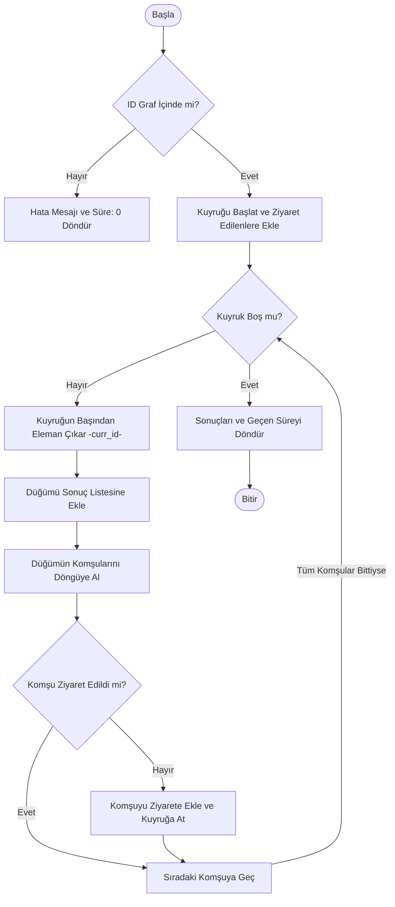

**Zaman Karmaşıklığı:**  
- O(V + E)

---

### 3.2 Depth First Search (DFS)

**Çalışma Mantığı:**  
DFS algoritması aramaya başladığı düğümden ulaşabileceği en derin düğüme kadar gider, gidecek daha derin bir düğüm kalmadığında geri sarar ve derin düğümlere öncelik vererek gezmeye devam eder.

**Akış Diyagramı**
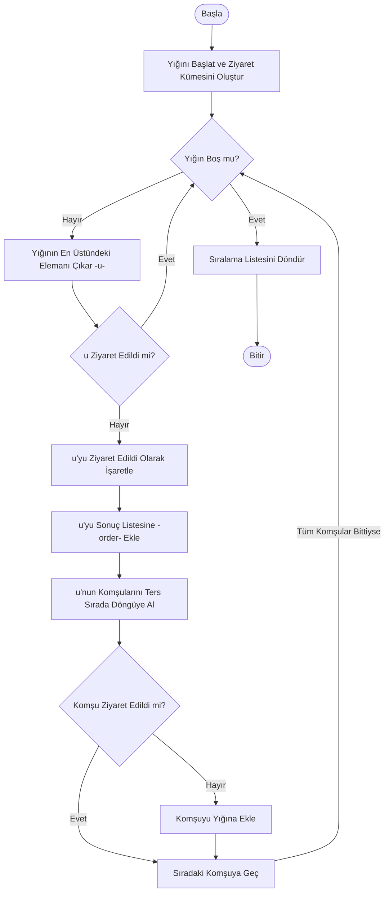

**Zaman Karmaşıklığı:**  
- O(V + E)

---

### 3.3 Dijkstra Algoritması

**Çalışma Mantığı:**  
Dijkstra algoritması, bir başlangıç düğümünden diğer tüm düğümlere olan en kısa yol mesafelerini bulmak için kullanılır. Temel olarak, algoritma her adımda henüz işlenmemiş düğümler arasından en kısa mesafeye sahip olanı seçer ve bu düğümü işler. Seçilen düğümün komşularının mesafelerini günceller ve ardından bir sonraki adıma geçer. Bu işlem, hedef düğüme ulaşılıncaya kadar veya tüm düğümler işlenene kadar devam eder.

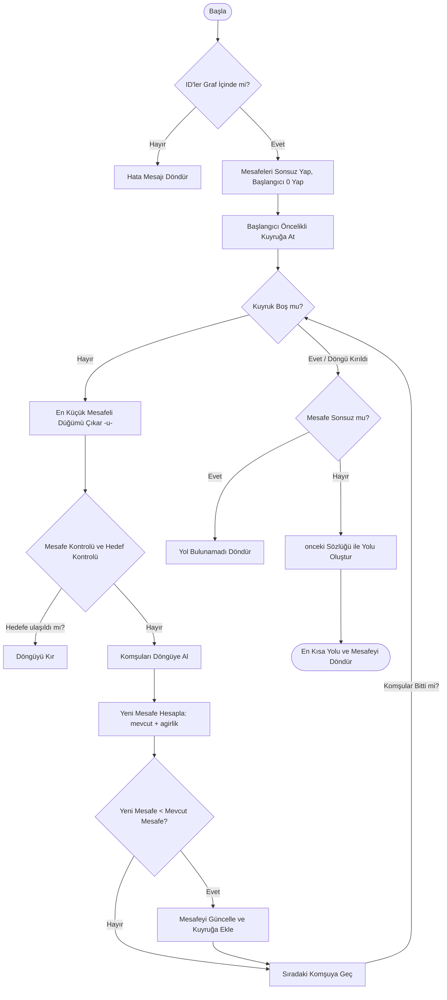

**Zaman Karmaşıklığı:**  
- O((V + E) log V)

---

### 3.4 A* Algoritması

**Çalışma Mantığı:**  
A* algoritması, temelde başlangıç düğümüyle bitiş düğümü arasındaki bütün diğer düğümlerin konumlarına göre hesaplama yaparak optimum sonuca ulaşır.

- f(n) = g(n) + h(n)

- f(n) : Hesaplanan toplam yol fonksiyonu

- g(n): İlk düğüm noktasıyla, mevcut düğüm noktası arasındaki maliyet

- h(n): Sezgisel fonksiyon

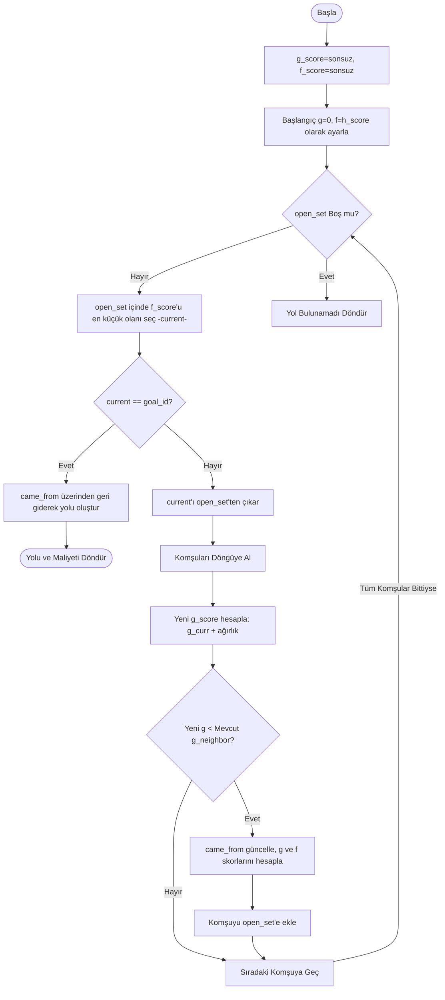

**Zaman Karmaşıklığı:**  
- Ortalama: O(E)

---

### 3.5 Merkezilik (Degree Centrality)
- Bir düğümün ne kadar çok bağlantısı varsa, o kadar merkezidir mantığına dayanır. Sosyal medya üzerinden örnek verirsek; en çok takipçisi olan kişi, o ağın en merkezi kişisidir.
- Düğüm derecelerine göre en etkili kullanıcılar belirlenir
- İlk 5 düğüm tablo halinde gösterilir

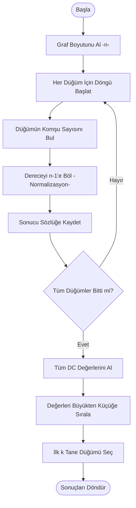

**Zaman Karmaşıklığı:**  
- O(V \log V)

---

### 3.6 Welsh–Powell Graf Renklendirme

- Welsh-Powell algoritması, bir grafın düğümlerini, birbirine komşu olan iki düğüm aynı renge boyanmayacak şekilde minimum sayıda renk kullanarak boyamayı amaçlayan bir "Greedy" (açgözlü) yaklaşımdır.
- Düğümler derecelerine göre büyükten küçüğe doğru sıralanır.
- İlk renk birinci sıradaki düğüme ve bu düğümün komşusu olmayan düğümlere atanır.
- Bir sonraki renge geçilir ve bu renk sıradaki derecesi en yüksek olan düğüme ve bu düğümün komşusu olmayan düğümlere atanır.
- Süreç bu şekilde renklendirilmemiş düğüm kalmayana kadar devam ettirilir.

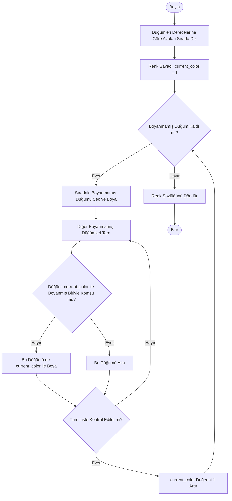

**Zaman Karmaşıklığı:**  
- O(V^2)

---

### 3.7 Bağlı Bileşenler

- Bağlı Bileşenler (Connected Components) algoritması, bir grafın birbirine hiçbir şekilde bağlı olmayan "alt adacıklarını" tespit etmek için kullanılır.
- Sosyal medya örneğiyle açıklarsak; bir arkadaş grubu içindeki herkes birbirine bir şekilde ulaşıyorsa bu bir gruptur, ancak tamamen kopuk başka bir arkadaş grubu varsa bu ayrı bir bağlı bileşendir.

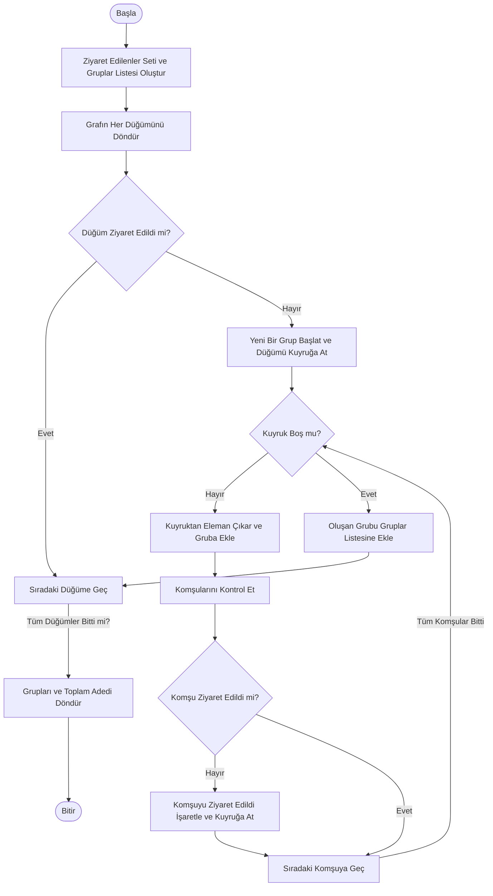

**Zaman Karmaşıklığı:**  
- O(V + E)

---

## 4. Sınıf Yapısı ve Modüller

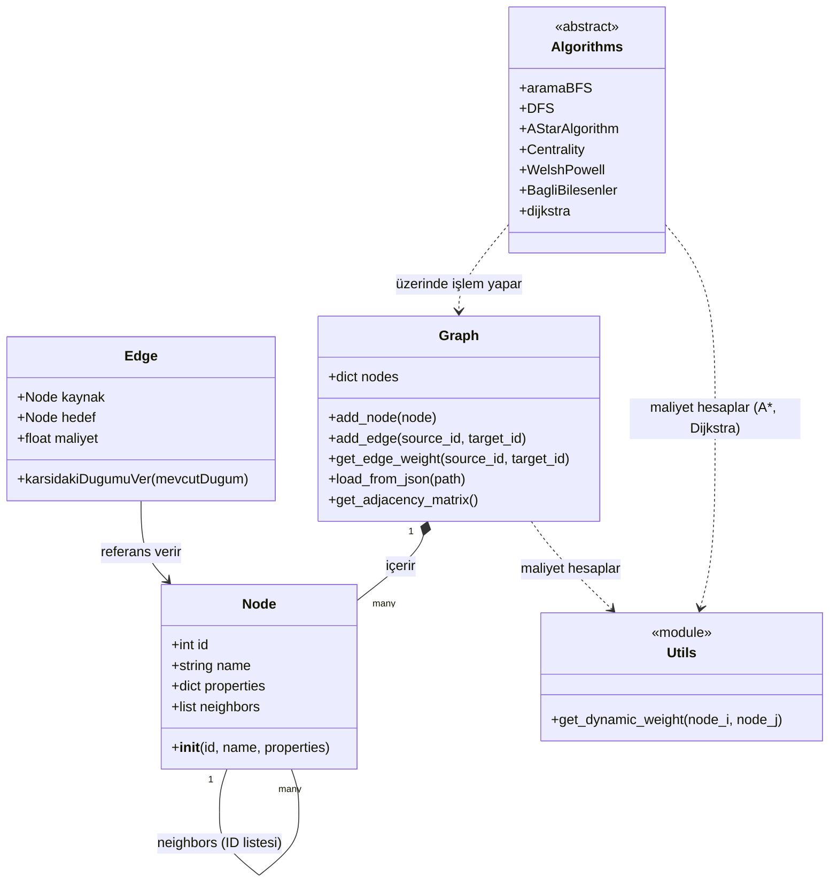

---

## 5. Uygulama, Testler ve Sonuçlar

### Test Sonuçları

| Düğüm Sayısı | Algoritma            | Süre (ms) |
|-------------|----------------------|-----------|
| 15          | BFS                  | 3         |
| 60          | BFS                  | 7         |
| 15          | DFS                  | 3         |
| 60          | DFS                  | 8         |
| 15          | Dijkstra             | 18        |
| 60          | Dijkstra             | 52        |
| 15          | A*                   | 14        |
| 60          | A*                   | 39        |
| 15          | Welsh–Powell         | 9         |
| 60          | Welsh–Powell         | 31        |
| 15          | Connected Components | 4         |
| 60          | Connected Components | 11        |
| 15          | Centrality           | 2         |
| 60          | Centrality           | 6         |

---

## 5. Uygulama ve Proje Görselleri

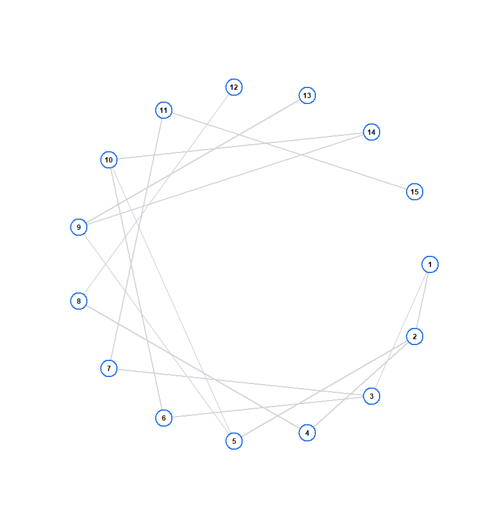

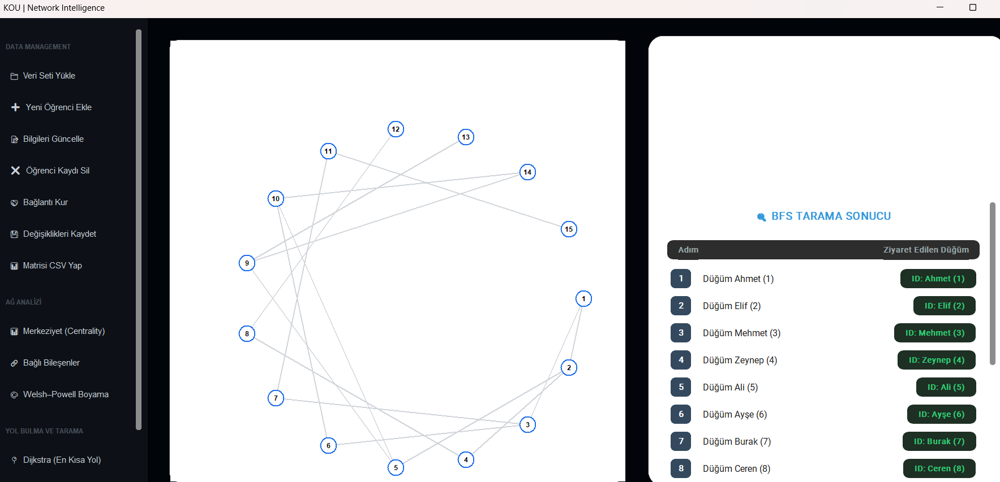

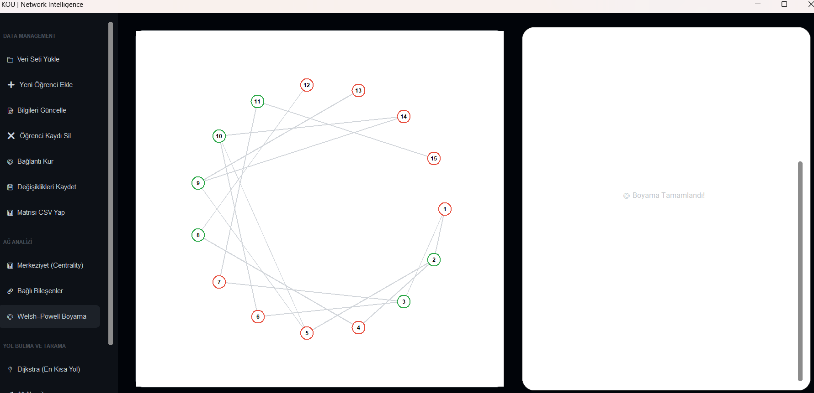

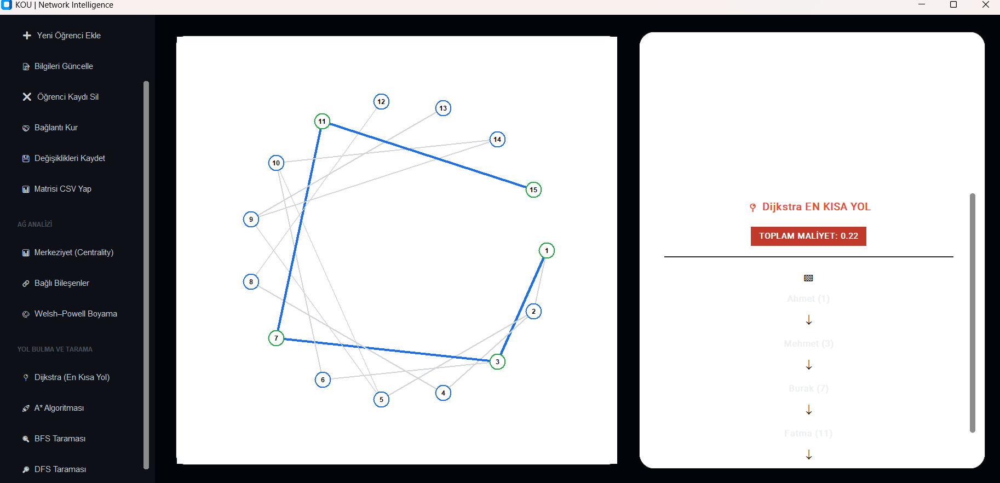

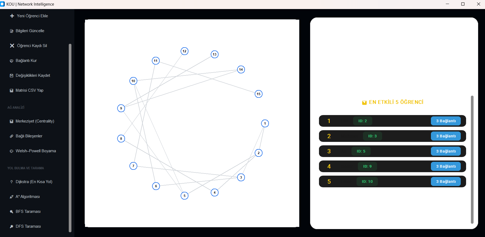

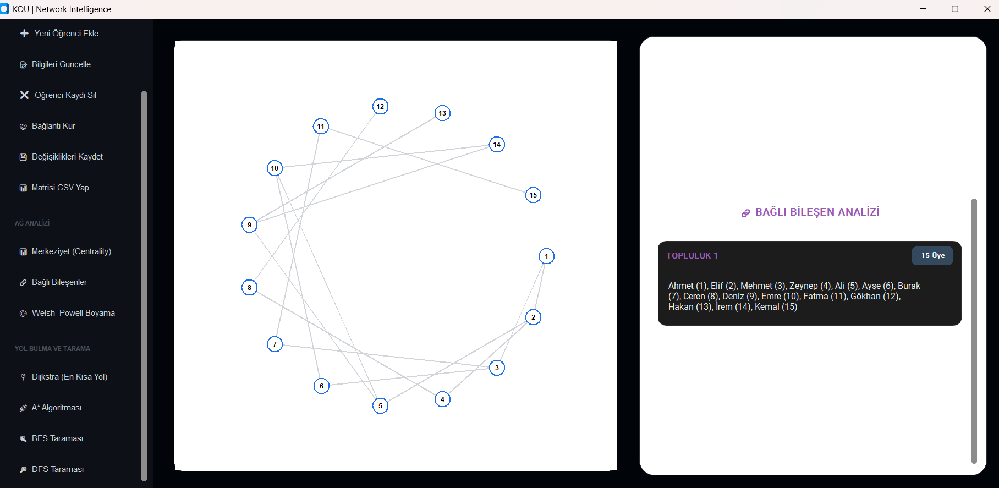
---

## 6. Sonuç ve Tartışma

### Başarılar
- Algoritmalar başarıyla gerçeklenmiştir
- OOP prensiplerine uyulmuştur

### Sınırlılıklar
- Büyük graflarda performans düşmektedir

### Olası Geliştirmeler
- Daha gelişmiş merkezilik ölçütleri
- Büyük ölçekli graf optimizasyonları

